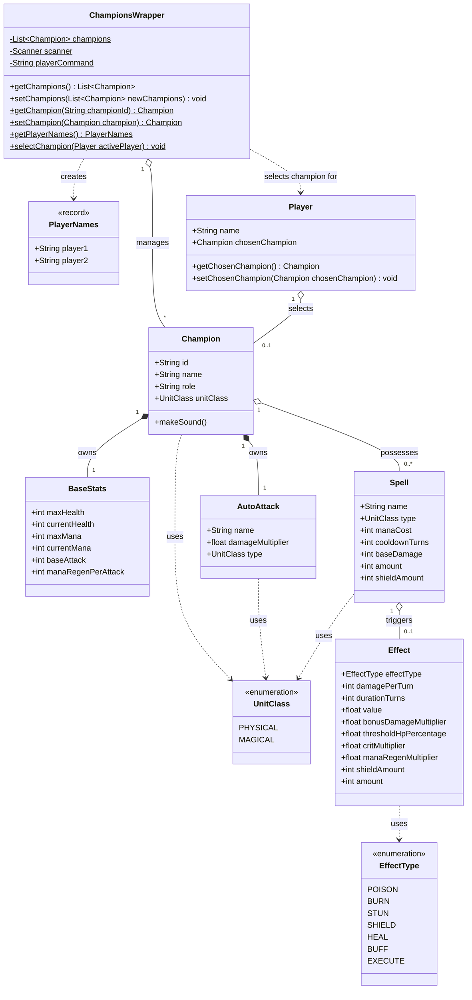

```mermaid
classDiagram
    %% Enum Definitions
    class UnitClass {
        <<enumeration>>
        PHYSICAL
        MAGICAL
    }

    class EffectType {
        <<enumeration>>
        POISON
        BURN
        STUN
        SHIELD
        HEAL
        BUFF
        EXECUTE
    }

    %% Utility & Wrapper Classes
    class ChampionsWrapper {
        -List~Champion~ champions$
        -Scanner scanner$
        -String playerCommand$
        +getChampions() List~Champion~
        +setChampions(List~Champion~ newChampions) void
        +getChampion(String championId)$ Champion
        +setChampion(Champion champion)$ Champion
        +getPlayerNames()$ PlayerNames
        +selectChampion(Player activePlayer)$ void
    }

    class PlayerNames {
        <<record>>
        +String player1
        +String player2
    }

    class Player {
        +String name
        +Champion chosenChampion
        +getChosenChampion() Champion
        +setChosenChampion(Champion chosenChampion) void
    }

    %% Main Entities
    class Champion {
        +String id
        +String name
        +String role
        +UnitClass unitClass
        +makeSound()
    }

    class BaseStats {
        +int maxHealth
        +int currentHealth
        +int maxMana
        +int currentMana
        +int baseAttack
        +int manaRegenPerAttack
    }

    class AutoAttack {
        +String name
        +float damageMultiplier
        +UnitClass type
    }

    class Spell {
        +String name
        +UnitClass type
        +int manaCost
        +int cooldownTurns
        +int baseDamage
        +int amount
        +int shieldAmount
    }

    class Effect {
        +EffectType effectType
        +int damagePerTurn
        +int durationTurns
        +float value
        +float bonusDamageMultiplier
        +float thresholdHpPercentage
        +float critMultiplier
        +float manaRegenMultiplier
        +int shieldAmount
        +int amount
    }

    %% Relationships
    ChampionsWrapper "1" o-- "*" Champion : manages
    ChampionsWrapper ..> Player : selects champion for
    ChampionsWrapper ..> PlayerNames : creates
    
    Player "1" o-- "0..1" Champion : selects

    Champion "1" *-- "1" BaseStats : owns
    Champion "1" *-- "1" AutoAttack : owns
    Champion "1" o-- "0..*" Spell : possesses
    Spell "1" o-- "0..1" Effect : triggers

    Champion ..> UnitClass : uses
    AutoAttack ..> UnitClass : uses
    Spell ..> UnitClass : uses
    Effect ..> EffectType : uses
```
